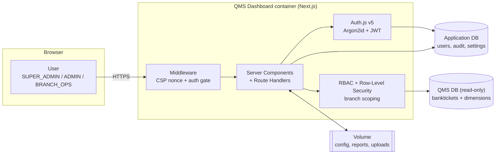

# QMS Analytics Dashboard

A self-hosted analytics dashboard for a bank **Queue Management System (QMS)**.
It reads queue/ticket data from a read-only QMS database and turns it into
branch KPIs, productivity and leaderboard views, SLA/exception tracking,
customer-feedback (NPS) analytics, exportable reports, and secure internal
messaging — with role-based access and row-level (per-branch) security.

Built with **Next.js 15 (App Router) + React 19**, **MySQL / SQL Server**,
**Auth.js v5**, **Argon2id**, and **Tailwind v4 / shadcn (base-ui)**.

> **New here?** Read [`docs/ARCHITECTURE.md`](docs/ARCHITECTURE.md) for the system
> design and diagrams, and [`docs/DEPLOYMENT.md`](docs/DEPLOYMENT.md) for a full
> production deployment guide. To publish this to GitHub and run it in
> production, see [`docs/GITHUB.md`](docs/GITHUB.md). This README is the fast path
> to running it.

---

## Table of contents

- [Features](#features)
- [Architecture at a glance](#architecture-at-a-glance)
- [Quick start with Docker](#quick-start-with-docker) ← clone → run → configure
- [Local development](#local-development)
- [Running the tests](#running-the-tests)
- [Configuration reference](#configuration-reference)
- [Security model](#security-model)
- [Project layout](#project-layout)
- [Troubleshooting](#troubleshooting)

---

## Features

- **Dashboards** — Home KPIs, Branch Overview, Productivity, Leaderboard,
  Exceptions, Feedback/NPS, agent activity, live data status.
- **Reports** — generate and download Excel/PDF, plus scheduled reports driven
  by a secured cron endpoint.
- **Exports** — any chart or table to Excel, row-capped to protect memory.
- **Messaging** — internal messages with file attachments (MIME allow-listed,
  size-limited).
- **Administration** — user management, brand/theme settings (logo upload +
  automatic colour extraction, light/dark default), and a tamper-evident audit
  log.
- **Security** — self-managed auth (Argon2id), account lockout, JWT sessions,
  RBAC + row-level branch scoping, nonce-based CSP, strict security headers.

## Architecture at a glance



Two databases, deliberately separated: the **QMS DB** is the bank's read-only
replica (the app only ever `SELECT`s from the `banktickets` fact table and its
dimensions), and the
**application DB** holds users, the audit log, settings and report metadata.
All mutable files (DB config, generated reports, attachments, logo) live under a
single directory (`APP_CONFIG_DIR`) that you mount as a volume. See
[`docs/ARCHITECTURE.md`](docs/ARCHITECTURE.md) for the full set of diagrams.

---

## Quick start with Docker

**Prerequisites:** [Docker](https://docs.docker.com/get-docker/) with the
Compose plugin (`docker compose version` should work).

```bash
# 1. Clone
git clone https://github.com/<your-org>/qms-dashboard.git
cd qms-dashboard

# 2. Create your environment file and edit the secrets
cp .env.example .env
#   In .env, set at minimum:
#     AUTH_SECRET           -> openssl rand -base64 32
#     CRON_SECRET           -> openssl rand -hex 32
#     MYSQL_ROOT_PASSWORD   -> a strong password
#     APP_DB_PASSWORD       -> a strong password
#     QMS_DB_HOST=db        -> use the bundled MySQL (or your replica's host)
#     QMS_DB_USER=qms_user  -> matches deploy/mysql-init/01-init.sql
#     QMS_DB_NAME=qms

# 3. Build and start
docker compose up -d --build

# 4. Watch it come up healthy
docker compose ps
curl -fsS http://localhost:3000/api/health   # {"status":"starting"|"ok", ...}
```

Then open **http://localhost:3000**. Because no application database is
configured yet, you'll be redirected to the **`/setup` wizard**:

1. **Choose the engine** (MySQL) and enter the application-DB connection. With
   the bundled Compose DB that is `host=db, port=3306, user=app_user,
   password=<APP_DB_PASSWORD>, database=appdb`.
2. The wizard **creates the application tables** and your **first Super Admin**
   account (email, name, a 12+ character password).
3. You're taken to the login screen. Sign in as that admin.

That's it — the app is running. Add more users from **Admin → User management**,
set branding/theme in **Settings**, and point the QMS side at real data by
loading a QMS dump into the `qms` database (see
[`docs/DEPLOYMENT.md`](docs/DEPLOYMENT.md#qms-data-the-read-side)).

> The `/setup` wizard is only reachable until the app is configured; afterwards
> it refuses to run again. Re-configuring is a deliberate, out-of-band action
> (delete `app-config.json` from the volume and restart).

**Common operations**

```bash
docker compose logs -f app        # tail application logs
docker compose down               # stop (keeps volumes/data)
docker compose down -v            # stop and DELETE all data (fresh start)
docker compose up -d --build      # rebuild after pulling new code
```

---

## Local development

**Prerequisites:** Node.js 20+ and a reachable MySQL (or SQL Server).

```bash
npm install
cp .env.example .env.local        # fill in AUTH_SECRET, QMS_DB_*, CRON_SECRET
npm run dev                       # http://localhost:3000  (then /setup)
```

`npm run dev` starts Next.js in development mode. The first visit redirects to
`/setup` exactly as in Docker. The looser development CSP allows Fast Refresh;
production uses the strict nonce-based policy.

Useful scripts:

| Command | What it does |
| --- | --- |
| `npm run dev` | Development server |
| `npm run build` | Production build |
| `npm start` | Serve the production build |
| `npm run lint` | ESLint |
| `npm test` | Run the test suite once |
| `npm run test:watch` | Tests in watch mode |
| `npm run seed:user` | Create/seed a user from the CLI |
| `npm run reset:password` | Reset a user's password from the CLI |

---

## Running the tests

The suite is [Vitest](https://vitest.dev/) running in Node (the code under test
is server-side security and data logic). Full details in
[`docs/TESTING.md`](docs/TESTING.md).

```bash
npm test              # run everything once (CI mode)
npm run test:watch    # re-run on change while developing
npx vitest run tests/logo-scale.test.ts   # a single file
```

No database is required — tests exercise pure logic (RBAC/branch scoping,
input clamping, hashing helpers, etc.). Inside Docker you can run them in a
throwaway build container with:

```bash
docker build --target builder -t qms-dashboard:test .
docker run --rm qms-dashboard:test npm test
```

---

## Configuration reference

All configuration is via environment variables (`.env` for Docker, `.env.local`
for local dev). Secrets must **never** be committed. See `.env.example` for the
annotated template.

| Variable | Required | Purpose |
| --- | --- | --- |
| `AUTH_SECRET` | ✅ | Signs/encrypts session JWTs. `openssl rand -base64 32`. |
| `SESSION_MAX_AGE` | | Session lifetime in seconds (default `1800`). |
| `AUTH_MAX_FAILED` | | Failed logins before lockout (default `5`). |
| `AUTH_LOCKOUT_MINUTES` | | Lockout duration (default `15`). |
| `QMS_DB_HOST` / `PORT` / `USER` / `PASSWORD` / `NAME` | ✅ | Read-only QMS database connection. |
| `QMS_DB_POOL` | | QMS connection pool size (default `10`). |
| `QMS_DB_CA` | | PEM CA cert to force verified TLS to the QMS DB. |
| `CRON_SECRET` | ✅ | Authorizes the scheduled-reports endpoint. Fails closed if unset. |
| `EXPORT_MAX_ROWS` | | Max rows per Excel export (default `100000`). |
| `STREAM_INTERVAL_MS` | | Live status poll interval (default `5000`). |
| `APP_CONFIG_DIR` | | Where mutable state is written (set to the mounted volume). |
| **Compose-only:** `APP_PORT`, `MYSQL_ROOT_PASSWORD`, `APP_DB_NAME/USER/PASSWORD` | | Provision the bundled MySQL and host port. |

> The **application** database credentials are **not** set via env — they're
> entered once in the `/setup` wizard and stored (mode `0600`) in
> `app-config.json` on the volume.

---

## Security model

- **Authentication** — Auth.js v5 Credentials provider, passwords hashed with
  **Argon2id** (memory-hard). Failed attempts increment a lockout counter.
- **Sessions** — short-lived JWTs (30 min default), secure-prefixed cookies over
  HTTPS.
- **Authorization** — three roles (`SUPER_ADMIN`, `ADMIN`, `BRANCH_OPS`) with
  **row-level security**: branch-scoped users only ever see their branches,
  enforced in SQL with parameterized, fail-closed (`1=0`) predicates.
- **Injection defence** — every query uses bound parameters; client-supplied
  identifiers (sort/group columns) are checked against an allow-list.
- **Transport & headers** — HSTS, `X-Frame-Options: DENY`, `nosniff`, a strict
  **nonce-based Content-Security-Policy** (`strict-dynamic`, no `unsafe-inline`
  scripts in production), and a locked-down sandbox CSP for user-uploaded files.
- **Audit** — a tamper-evident (SHA-256 hash-chained) log of administrative and
  sign-in activity, with an integrity check.
- **Least privilege** — the QMS DB user should be granted **SELECT only**; the
  container runs as a non-root user.

See [`docs/ARCHITECTURE.md`](docs/ARCHITECTURE.md#security-architecture) for the
threat model and defence-in-depth layers.

---

## Project layout

```
app/                 Next.js App Router (pages, API route handlers, error boundaries)
components/          UI components (shadcn/base-ui) and feature components
lib/                 Server logic: db, auth, rbac, analytics, reports, settings, audit
  db-adapters/       Pluggable MySQL / SQL Server engine adapters
db/schema.sql        QMS read-side contract + indexes (PART A) + app schema reference (PART B)
deploy/mysql-init/   First-run SQL for the bundled Compose database
scripts/             CLI helpers (seed user, reset password)
tests/               Vitest unit tests
docs/                Architecture, deployment and testing guides
Dockerfile           Multi-stage production image (standalone, non-root)
docker-compose.yml   App + MySQL one-command stack
```

---

## Troubleshooting

| Symptom | Fix |
| --- | --- |
| Browser stuck redirecting to `/setup` | The app DB isn't configured yet — complete the wizard. If already done, the volume may have been reset. |
| `/setup` says "already configured" | Expected after go-live. To reconfigure, remove `app-config.json` from the volume and restart. |
| App container unhealthy | `docker compose logs app`. Check `AUTH_SECRET` is set and the DB is reachable. `curl "localhost:3000/api/health?deep=1"` shows per-dependency status. |
| Login always fails | Verify the QMS/app DB creds and that the user is active/not locked. Use `npm run reset:password`. |
| Dashboards empty but app works | The `qms` database has no data yet — load a QMS dump and ensure the `banktickets` table (see `db/schema.sql` PART A) exists and is populated. |

For anything deeper, see [`docs/DEPLOYMENT.md`](docs/DEPLOYMENT.md).
