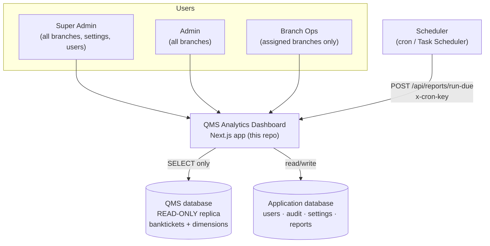
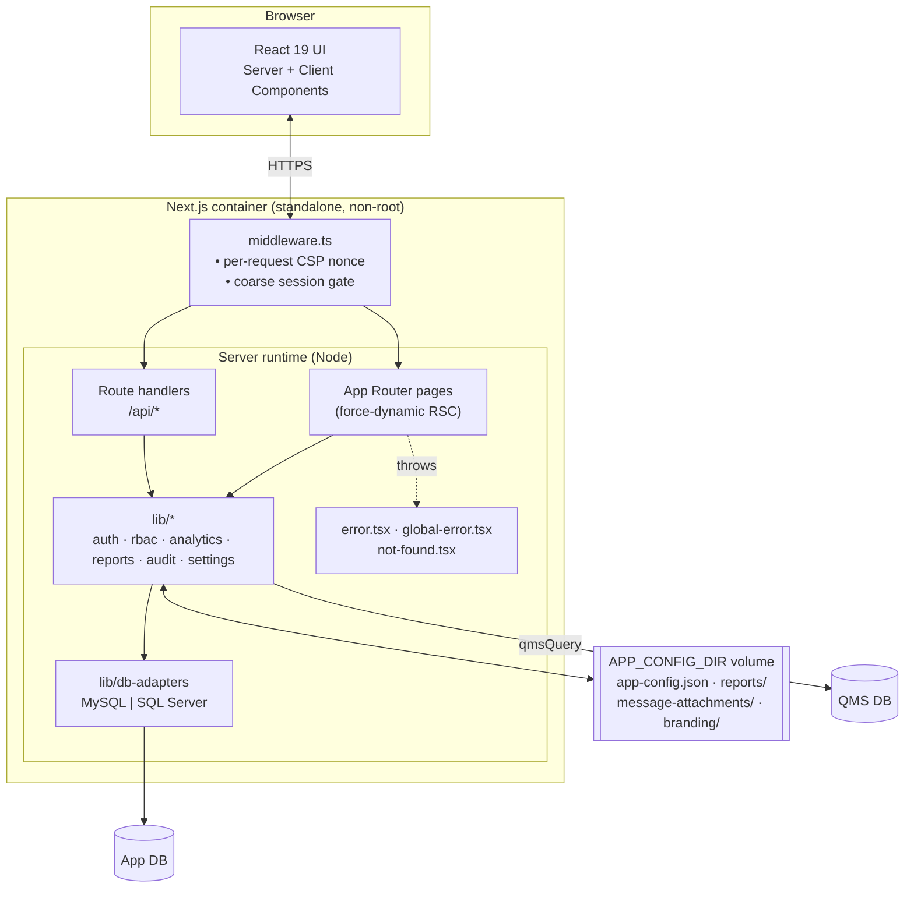
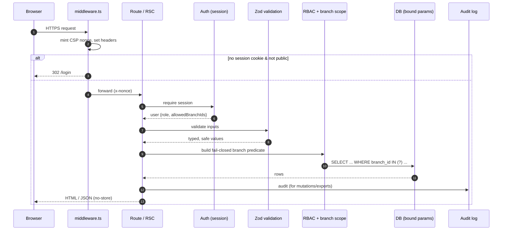
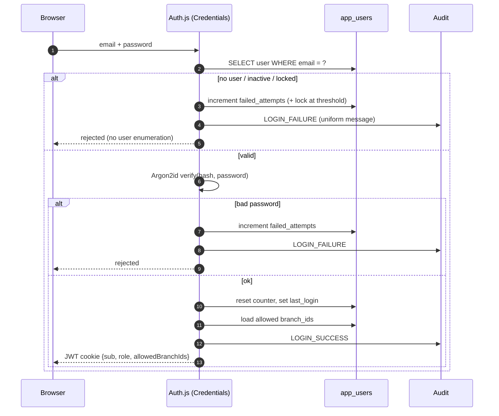
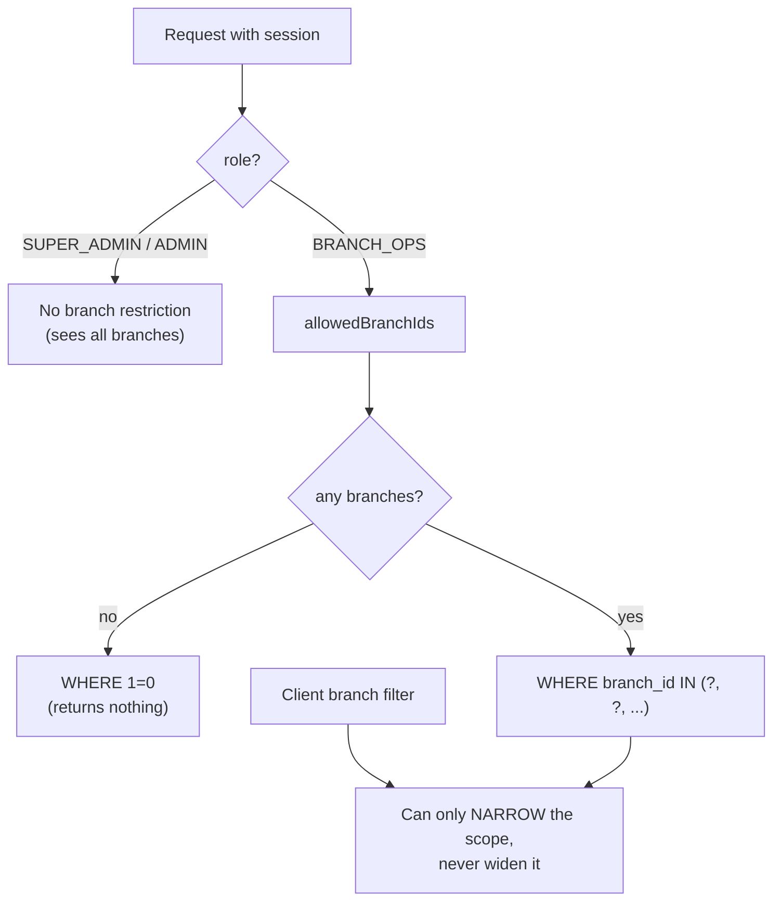
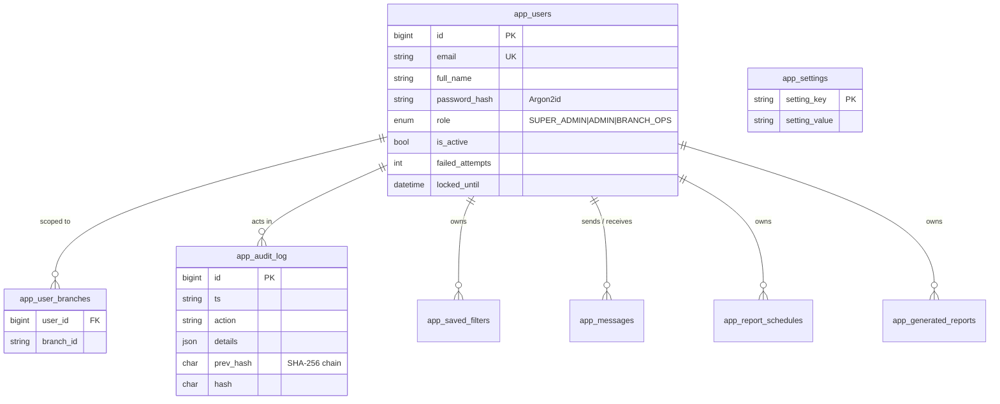
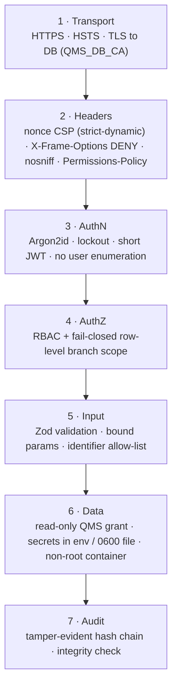
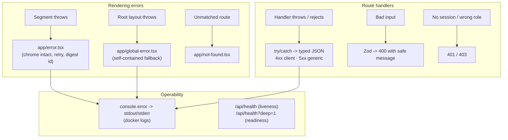
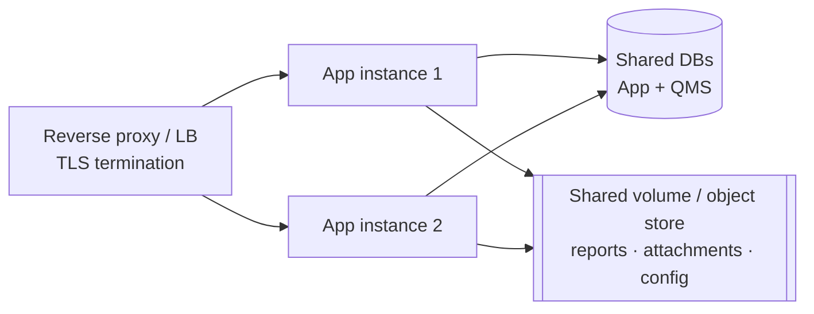

# Architecture

This document describes how the QMS Analytics Dashboard is built and why. It
covers the system context, the request lifecycle, the data model, the security
architecture, error handling, scalability, and the deployment topology. Diagrams
are [Mermaid](https://mermaid.js.org/) and render on GitHub.

- [1. System context](#1-system-context)
- [2. Container / component view](#2-container--component-view)
- [3. Request lifecycle](#3-request-lifecycle)
- [4. Authentication & session flow](#4-authentication--session-flow)
- [5. Row-Level Security](#5-row-level-security)
- [6. Data model](#6-data-model)
- [7. Security architecture](#7-security-architecture)
- [8. Error handling](#8-error-handling)
- [9. Scalability](#9-scalability)
- [10. Deployment topology](#10-deployment-topology)
- [11. Technology choices](#11-technology-choices)

---

## 1. System context

The dashboard sits between the bank's staff and two databases. It **never
writes** to the QMS data — that stays on a read-only replica owned by the bank.



**Key boundary:** the browser never talks to a database directly. Every query is
issued server-side, with bound parameters, after authorization.

---

## 2. Container / component view

Everything ships as **one Next.js container**. Persistent files live on a single
mounted volume; the two databases are external.



**Why one container:** the app is self-contained — no message broker, no
separate worker. State that must survive a restart is either in the databases or
under `APP_CONFIG_DIR`. That keeps the operational surface tiny for an on-prem
bank environment.

---

## 3. Request lifecycle

Every authenticated request passes through the same ordered gates. Authorization
is enforced **server-side on every route** — the middleware gate is only a coarse
first pass.



---

## 4. Authentication & session flow

Auth is self-managed (no external IdP). Passwords are verified with Argon2id;
the role and branch scope are baked into the JWT so downstream queries need no
extra round trip.



Sessions are short (30 min default, `SESSION_MAX_AGE`). The cookie is
secure-prefixed over HTTPS. `trustHost` is enabled for on-prem hosting behind a
reverse proxy.

---

## 5. Row-Level Security

Branch scoping is the core authorization primitive. It is built once per request
from the session and injected into every QMS query as bound parameters.



Two invariants:

1. **Fail closed.** A branch-scoped user with no branches gets `1=0`, not
   "everything". A missing scope never means "allow".
2. **Narrowing only.** A client-supplied branch filter intersects with the
   session scope; it can never expand what the user is allowed to see.

---

## 6. Data model

The **application** database (created by the `/setup` wizard, MySQL or SQL
Server) holds identity, audit and app state. The **QMS** database is the bank's
own queue system, read only — the `banktickets` fact table plus its branch,
queue, counter and user dimensions.



The audit log is a **hash chain**: each row stores `hash = SHA256(prev_hash +
row)`. Any edit or deletion breaks the chain and is detectable by the integrity
check surfaced on the Audit page.

Binary artefacts (generated reports, message attachments, the uploaded logo) are
stored as files under `APP_CONFIG_DIR`, with only their metadata in the DB. Each
on-disk name is an opaque server-generated UUID, and reads guard against path
traversal.

---

## 7. Security architecture

Defence in depth — no single control is trusted alone.



| Threat | Mitigation |
| --- | --- |
| SQL injection | Bound parameters everywhere; sort/group identifiers allow-listed; `multipleStatements` off. |
| XSS | Strict nonce CSP (`strict-dynamic`, no `unsafe-inline` scripts in prod); React escaping. |
| Clickjacking | `X-Frame-Options: DENY` + `frame-ancestors 'none'`. |
| Broken access control | Server-side authz on every route; fail-closed branch scope; middleware is only a coarse gate. |
| Credential theft / brute force | Argon2id, account lockout, uniform failure messages, short sessions. |
| Privilege via the app to QMS data | QMS DB user granted **SELECT only** — the app physically cannot mutate queue data. |
| Malicious uploads | MIME allow-list + size cap; served under a sandbox CSP; opaque keys; traversal guards. |
| Tampering with history | Hash-chained audit log with verification. |
| Secret leakage | Secrets in env vars / a `0600` config file, both git-ignored; never baked into the image. |
| Unauthorized report scheduling | Cron endpoint requires `CRON_SECRET`; fails closed if unset. |

---

## 8. Error handling

Errors are contained at every layer and never leak internals to the user.



Principles:

- **No stack traces to users.** UI boundaries show a friendly message and a
  correlation `digest`; the real error goes to the server logs.
- **Fail closed, not open.** Missing config, an unset `CRON_SECRET`, or an empty
  branch scope all deny rather than expose data.
- **Structured HTTP.** Route handlers return typed JSON with correct status
  codes (400 validation, 401/403 authz, 404 missing, 5xx generic).
- **Observable.** Logs go to stdout/stderr for `docker logs` / a log driver, and
  `/api/health` gives liveness and (with `?deep=1`) per-dependency readiness.

---

## 9. Scalability

The app is designed to scale **vertically first, then horizontally** with two
caveats to address before running multiple instances.



- **Stateless requests.** Sessions are JWTs in cookies — no server-side session
  store — so any instance can serve any request.
- **Connection pooling.** Both DB paths use bounded pools (`QMS_DB_POOL`, adapter
  pools) with keep-alive and idle timeouts.
- **Read/write split by design.** Heavy analytics hit the read-only QMS replica,
  isolating reporting load from the small application DB.
- **Caveats for multi-instance:**
  1. **Shared file state.** `APP_CONFIG_DIR` must be shared storage (NFS/SMB or
     an object store) so every instance sees the same reports/attachments/config.
  2. **The scheduler must run once.** Point the cron trigger at a single
     instance (or a load-balancer path that lands on one) so due reports aren't
     generated multiple times.

For most on-prem bank deployments a **single well-resourced instance** behind a
TLS-terminating reverse proxy is the right, simplest answer.

---

## 10. Deployment topology

Recommended on-prem topology. The dashboard runs in the intranet DMZ; databases
stay in the data tier.

```mermaid
flowchart TB
  subgraph Intranet["Bank intranet"]
    subgraph Edge["Edge / DMZ"]
      RP["Reverse proxy (nginx/Traefik)<br/>TLS · HSTS · forwards headers"]
    end
    subgraph AppTier["Application tier"]
      C["qms-dashboard container<br/>non-root · standalone"]
      V[["Volume: APP_CONFIG_DIR"]]
    end
    subgraph DataTier["Data tier"]
      APP[("Application DB")]
      QMS[("QMS read-only replica")]
    end
    SCHED["Scheduler<br/>cron / Task Scheduler"]
  end
  Staff["Staff browsers"] -->|HTTPS| RP -->|HTTP (private)| C
  C --> V
  C -->|TLS| APP
  C -->|TLS, SELECT only| QMS
  SCHED -->|x-cron-key| RP
```

**A note on Vercel / serverless.** This app is intentionally **stateful on the
local filesystem** (the `/setup` config file, generated reports, attachments and
logo all live under `APP_CONFIG_DIR`) and relies on **long-lived DB connection
pools**. Vercel's serverless functions have an ephemeral filesystem and don't
keep pools warm, and a bank's read-only replica generally isn't reachable from a
public serverless platform anyway. **Deploy it as a container** (Docker on a VM,
Compose, or Kubernetes) on the intranet. See
[`DEPLOYMENT.md`](DEPLOYMENT.md) for the step-by-step.

---

## 11. Technology choices

| Concern | Choice | Why |
| --- | --- | --- |
| Framework | Next.js 15 App Router + React 19 | Server Components keep data access server-side; one deployable unit. |
| Rendering | `force-dynamic` | Data is per-user and live; no stale caching of sensitive rows. |
| Auth | Auth.js v5 (Credentials) | Self-managed, no external IdP; JWT carries role + scope. |
| Password hashing | Argon2id (`@node-rs/argon2`) | Memory-hard, GPU-resistant; native prebuilt binaries. |
| App DB | MySQL or SQL Server via adapters | Meets the bank's existing DB estate; pluggable engine registry. |
| QMS access | mysql2 pool, SELECT-only | Read-only replica; bound params; TLS. |
| UI | Tailwind v4 + shadcn (base-ui) | Accessible primitives; `render` prop composition. |
| Exports | exceljs / pdfkit | Native Excel + PDF without external services. |
| Tests | Vitest (Node) | Fast unit tests of security/data logic; no DB needed. |
| Packaging | Docker standalone, non-root | Small image, least privilege, on-prem friendly. |

See [`DEPLOYMENT.md`](DEPLOYMENT.md) for operations and [`TESTING.md`](TESTING.md)
for the test guide.
